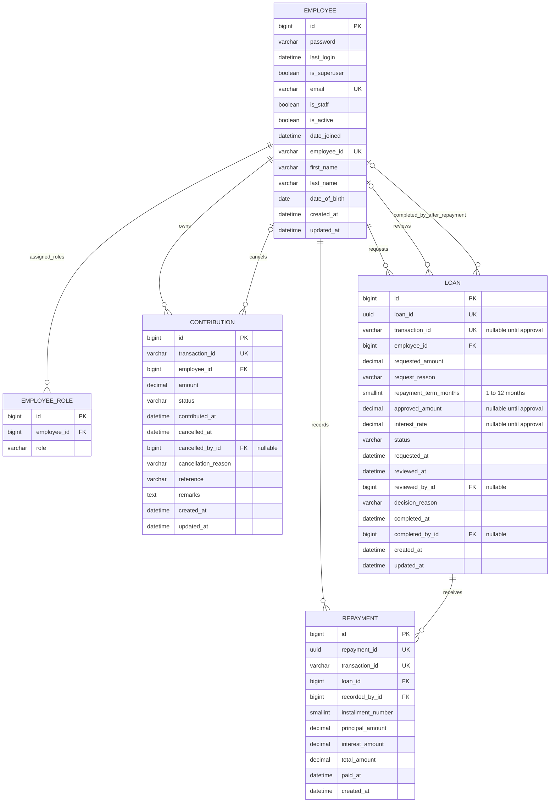
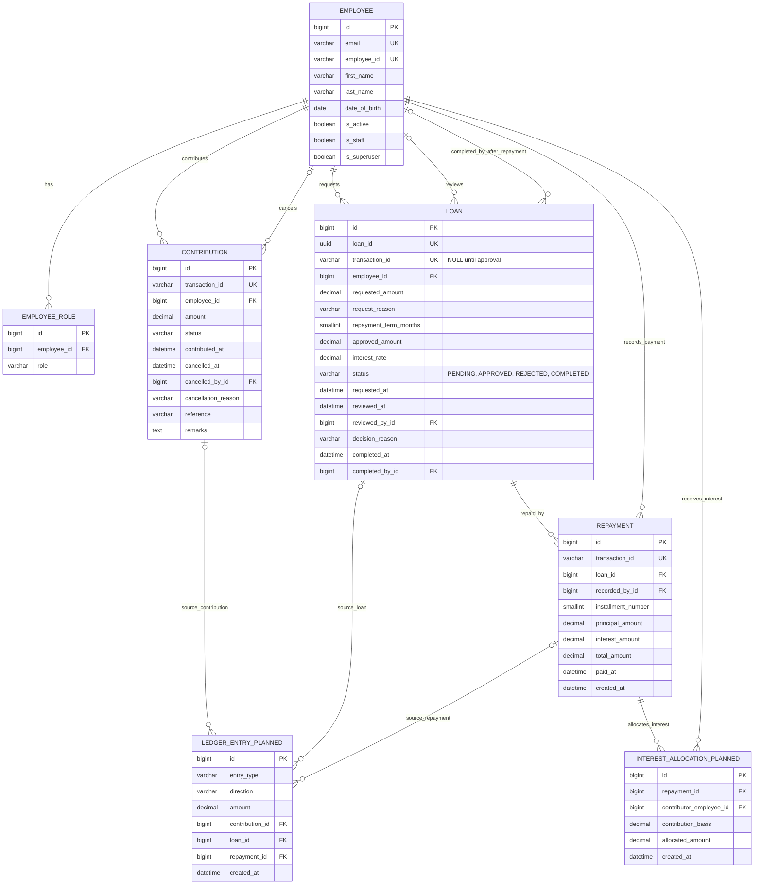
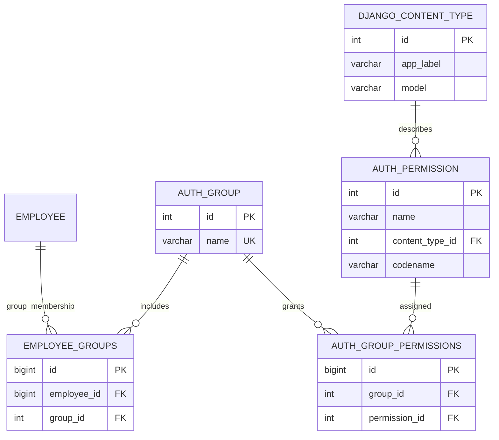

# Employee Lending System — Runtime and Target ERD

This document separates what is **implemented in the configured PostgreSQL database today** from the **planned complete lending design**. Planned entities are design guidance only; they are not current Django models or physical tables. The diagrams are divided into application-owned data and Django framework/support tables so that framework tables are not mistaken for lending-domain tables.

## Application tables

The application's five domain tables are `employee`, `employee_role`, `contribution`, `loan`, and `repayment`. No organization, fund-account, ledger-entry, or interest-allocation table exists in the current physical database.

## Complete lending domain (current + planned apps)

The following is the target domain ERD across the current and future app boundaries. `EMPLOYEE`, `EMPLOYEE_ROLE`, `CONTRIBUTION`, `LOAN`, and `REPAYMENT` are implemented. `INTEREST_ALLOCATION` and `LEDGER_ENTRY` are proposed for future accounting work and must not be treated as deployed tables yet. The `_PLANNED` suffixes in this diagram label future entities; they are not literal Django table names.

### Future app boundaries

| App / area | Tables in the target design | Purpose / status |
| --- | --- | --- |
| `employee` | `employee`, `employee_role` | Implemented identity, authentication, and role assignment. |
| `contribution` | `contribution` | Implemented contributions and cancellation history. Contributions are active immediately. |
| `loan` | `loan` | Implemented requests and decisions. Fully repaid loans transition automatically to `COMPLETED`; no `DISBURSED` status. |
| `repayment` | `repayment` | Implemented borrower repayment records, principal balance validation, and automatic loan completion. |
| Future interest/accounting app | `interest_allocation`, `ledger_entry` | Proposed distribution audit and append-only fund transaction history; not implemented. |
| `common` | No database tables | Shared rules, exceptions, logging, and utilities. |

There is no `organization` table: this installation represents one organization and uses fixed rules in configuration. A separate `FundAccount` table is also not part of the current or required target diagram; the current available-funds value is derived. If a future ledger becomes the authoritative balance source, its posting and balance-reconciliation policy should be agreed before implementation.

## Django authorization bridge

`Employee` inherits Django's `PermissionsMixin`, so the database also contains `auth_group` and the `employee_groups` many-to-many bridge. These enable Django group-based permissions. Application roles (`admin`, `approver`, `developer`, and `tester`) are stored separately in `employee_role`; the current loan permissions check the `admin`/`approver` roles (and superuser status), not Django groups.

> Django's standard `Employee.user_permissions` many-to-many model field has no corresponding physical join table in this database snapshot. Do not draw an employee-user-permission relationship as present unless its table is created/applied.

## Django operational tables (not lending entities)

These are present in the database for framework operation, but are not part of the lending domain ERD:

| Physical table | Purpose |
| --- | --- |
| `django_admin_log` | Django admin change history; its user FK points to `employee`. |
| `django_session` | Django session storage. |
| `django_migrations` | Records applied migrations, not application business data. |
| `django_content_type` | Framework registry of installed model types; referenced by `auth_permission` and admin log entries. |
| `auth_group`, `auth_group_permissions`, `auth_permission` | Django's optional group/permission framework. |
| `employee_groups` | Django `PermissionsMixin` group-membership join table. |

## Domain rules captured by the schema

- `employee_role` has a unique constraint on (`employee_id`, `role`).
- Contributions have `ACTIVE` and `CANCELLED` statuses; amounts must be positive. Application services enforce the configured contribution range and per-employee active-total cap.
- Loans have `PENDING`, `APPROVED`, `REJECTED`, and `COMPLETED` statuses. There is no `DISBURSED` status.
- A loan's `loan_id` identifies a request from creation. `transaction_id` is nullable until approval.
- A database constraint requires approved terms and a transaction ID for `APPROVED`/`COMPLETED` loans, while `PENDING`/`REJECTED` loans have no transaction ID or approved terms.
- A partial unique constraint permits at most one `PENDING` or `APPROVED` loan per employee.
- Each repayment stores principal, interest, and total; a database check enforces `total = principal + interest`.
- A borrower can repay only their own `APPROVED` loan, and principal cannot exceed remaining principal.
- Available funds are calculated by application logic as active contributions minus remaining approved-loan principal; principal repayment releases funds. No separate balance table is used.
- A loan becomes `COMPLETED` automatically when its approved principal has been fully repaid.
- Repayment records carry generated transaction IDs and a sequential installment number unique within each loan.
- Loan repayment term is 1–12 months; total flat interest is calculated for the selected term, and monthly cent-rounding is reconciled in the final installment.

## Historical migration notes

- The database has an old migration record under app label `organization`, but there is no physical organization table.
- Old applied loan draft migrations once defined fund tables. The current cleanup migration removes those tables when empty; they are not present in the current schema snapshot.
- Interest allocation and ledger tables have not been implemented.

The table inventory was checked from the configured PostgreSQL database using the project's virtual environment. Table state can differ between environments until their migrations are synchronized.
