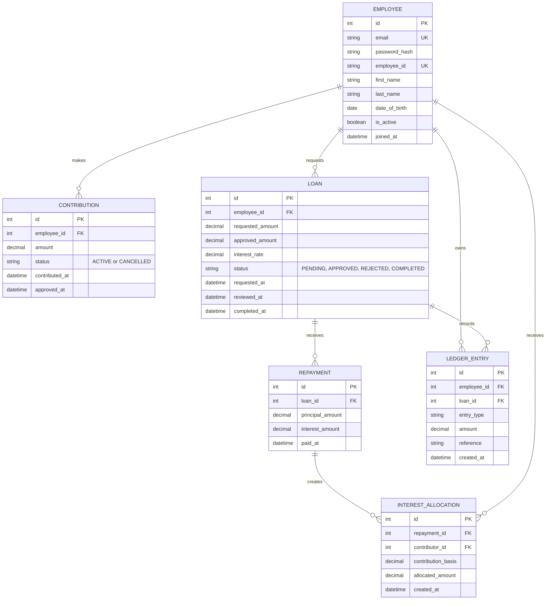

# Organizational Employee Lending System

## 1. Purpose

This Django application provides employee authentication and administration, employee contributions, loan requests and decisions, loan repayments, and a calculated available-funds balance. Ledger/accounting and contributor interest allocation remain future work.

This is a learning project. Version 1 uses an internal ledger and does not move real money through a bank or payment provider.

## 2. Version 1 Scope

### Currently implemented

- Custom employee authentication model.
- Employee ID as a unique business identifier.
- Automatic company email generation.
- DOB and minimum age validation of 18 years.
- Admin, approver, developer, and tester roles.
- Multiple roles per employee.
- Single protected superuser: `admin@hassy.in`.
- JWT authentication through Django REST Framework.
- Admin-only employee management APIs.
- Employee contribution APIs with automatic transaction IDs and cancellation history.
- Loan request, approval, rejection, repayment, and available-funds APIs.
- Loan approval reserves funds by reducing the calculated available balance.
- Centralized project exception handling and API error responses.

### Planned lending features

- Monthly or yearly allocation of collected interest to contributors.
- Append-only ledger-based fund audit and reconciliation.

### Excluded

- Real bank transfers or payment gateways.
- Multiple organizations or branches.
- Credit scoring, collateral, guarantors, penalties, or late fees.
- Installment schedules.
- Mobile applications, notifications, and advanced reports.
- Legal, tax, accounting, or regulatory decisions.

### Optional later features

- Monthly installments and due dates.
- Email or SMS notifications.
- React or mobile client.
- Multiple approval levels.
- Reports and CSV export.
- PostgreSQL deployment.
- Payment-provider integration and detailed audit history.

## 3. Architecture

Use a **modular monolith**: one Django project with separate `employee`, `contribution`, `loan`, and `repayment` Django apps, plus shared utilities in `common`.

```text
Client
  -> API / Views
  -> Forms or Serializers
  -> Service layer
  -> Models
  -> Database
```

- API and views receive requests and return responses.
- Serializers and forms validate input.
- Services perform lending operations and financial transactions.
- Models define stored data and relationships.
- Permissions enforce employee, approver, and administrator access.
- PostgreSQL is the configured database for this project.

Current app responsibilities: `employee` owns identity and roles; `contribution` owns contribution records and cancellation; `loan` owns loan requests and decisions; `repayment` owns repayment records and service-layer loan balance changes; `common` owns fixed lending rules, shared errors, and logging. Ledger and contributor interest distribution are not implemented yet.

## 4. Authentication and Authorization

Use one custom Django user model for employees. The model inherits from `AbstractBaseUser` and `PermissionsMixin`, so authentication and employee information are stored in the same database table.

```python
class Employee(AbstractBaseUser, PermissionsMixin):
    first_name = models.CharField(max_length=150)
    last_name = models.CharField(max_length=150)
    date_of_birth = models.DateField()
    email = models.EmailField(unique=True)
    employee_id = models.CharField(max_length=20, unique=True)
```

Configure it before creating application migrations:

```python
AUTH_USER_MODEL = "lending.Employee"  # legacy migration label; Python app package is employee
```

Use Django REST Framework and Simple JWT for API authentication. Django still stores users and hashes passwords; JWT supplies access and refresh tokens for API requests.

```http
Authorization: Bearer <access-token>
```

Use employee role assignments and reusable permissions:

- `Employee`: access only their own records and submit requests.
- `Approver`: approve or reject loan requests.
- `Administrator`: manage employees, roles, rules, permissions, and all records.

Reusable permission helpers are available as `IsSuperAdmin`, `HasRole('approver')`, and `HasAnyRole('approver', 'admin')`.

Email is the login identifier. Every protected endpoint must authenticate the user and filter records by the authenticated employee.

### Current employee APIs

All employee-management endpoints require a JWT issued to `admin@hassy.in`:

```text
POST   /api/auth/login/
POST   /api/auth/token/refresh/
GET    /api/employees/
POST   /api/employees/
GET    /api/employees/{employee_id}/
PATCH  /api/employees/{employee_id}/
POST   /api/employees/{employee_id}/deactivate/
POST   /api/employees/{employee_id}/roles/
DELETE /api/employees/{employee_id}/roles/{role}/
```

Employee creation accepts `first_name`, `last_name`, `date_of_birth`, and a list of roles. The generated initial password is not intended to remain in a production response.

### Current contribution APIs

An authenticated active employee can create and view contributions. Employees only see their own records. The super administrator can view all contributions and cancel them.

```text
POST   /api/contributions/
GET    /api/contributions/
GET    /api/contributions/summary/
GET    /api/contributions/{transaction_id}/
POST   /api/contributions/{transaction_id}/cancel/
```

Contribution creation accepts:

```json
{
    "amount": "25000.00",
    "reference": "September contribution",
    "remarks": "Monthly contribution"
}
```

The employee comes from the JWT and cannot be supplied by the client. Transaction IDs are generated automatically, for example `CONTRIB-20260924-8BF047F23B6D`. Contribution statuses are `ACTIVE` and `CANCELLED`. Cancelled contributions remain stored and are excluded from totals and future fund calculations.

The list and summary endpoints return:

```json
{
    "total_contributed": "35000.00",
    "available_funds": "35000.00",
    "active_contribution_count": 2,
    "cancelled_contribution_count": 0
}
```

`total_contributed` describes the relevant contribution queryset. `available_funds` is the organization-wide calculated balance: active contributions minus the remaining principal of approved loans.

The configured per-record contribution range is `10000.00` through `50000.00`; an employee's active contributions combined cannot exceed `50000.00`. No approval step is required for contributions; they become active immediately.

### Current loan APIs

Employees can submit loan requests and `GET /api/loans/` always returns only the authenticated employee's own loans, including when that employee is an approver or administrator. Admins (superusers or employees with the `admin` role) and approvers use the separate review queue to see all pending and approved requests, and can approve or reject them. The requesting employee cannot decide their own request.

```text
POST   /api/loans/
GET    /api/loans/
GET    /api/loans/review/
GET    /api/loans/funds/summary/
GET    /api/loans/{loan_id}/
GET    /api/loans/{loan_id}/installments/
POST   /api/loans/{loan_id}/approve/
POST   /api/loans/{loan_id}/reject/
```

The client supplies `requested_amount`, required `repayment_term_months` from 1 through 12, and a required, non-blank `request_reason` (maximum 1000 characters) when requesting a loan. The reason is retained on the loan record and shown to authorized viewers. Requests use a UUID `loan_id` for reference and start in `PENDING`; `transaction_id` remains `NULL` until approval. Loan statuses are `PENDING`, `APPROVED`, `REJECTED`, and `COMPLETED`; there is no `DISBURSED` status. Approvers may approve the requested amount or a lower amount, but not a higher amount. Approval snapshots the configured annual rate and creates the transaction ID. Rejection requires a reason, which is visible with the employee's loan record. Free-text request/rejection reasons are not included in application logs.

`GET /api/loans/review/` is restricted to admins and approvers and returns loans in `PENDING` or `APPROVED` status across all employees. It is separate from the personal loan list.

Available funds are calculated as active contribution total minus remaining principal on approved loans. Approval checks and reserves funds transactionally; each recorded principal repayment increases available funds by the principal amount paid. When all approved principal is repaid, the loan automatically becomes `COMPLETED`; completion is no longer manually set through the loan API. Contribution cancellation is rejected if it would leave approved loans underfunded. No fund-account or ledger table is created.

New loan requests are rejected if the employee has a `PENDING` or `APPROVED` loan, requests an amount outside configured bounds, or has not completed the two-calendar-month wait after their most recent completed loan. Month-end addition clamps to the final valid day in the resulting month.

The current repayment plan is **flat annual interest with fixed principal installments**: interest is calculated on the original approved principal for the selected term (`approved_amount × annual rate × term_months ÷ 12`) and does not decrease as principal is repaid. Principal and total interest are split across the term, with any cent-rounding remainder applied to the last installment. For example, 30,000 at 10% p.a. over 12 months yields 2,500 principal plus 250 interest each month, or 2,750 total. This is not a reducing-balance EMI calculation.

`GET /api/loans/{loan_id}/installments/` returns the calculated schedule plus `current_installment` (first unpaid) and `next_installment`. A pending loan has no schedule; completed loans return no unpaid current or next installment. Repayments must be submitted in installment order and match the calculated principal, interest, and total exactly.

### Current repayment APIs

Only the employee who owns an approved loan can make repayments. `GET /api/repayments/` returns repayment records submitted by the authenticated employee.

```text
POST   /api/repayments/
GET    /api/repayments/
```

The request supplies `loan_id`, `installment_number`, `principal_amount`, `interest_amount`, and `total_amount`. The installment must be the earliest unpaid installment, and the three amounts must match the server-calculated schedule exactly. Principal must be positive and cannot exceed remaining principal; interest cannot be negative; total must equal principal plus interest. Repayment validation and financial state changes are performed by the repayment service. Interest amounts are recorded, but distribution to contributors is not implemented yet.

Each saved repayment receives a unique, system-generated `transaction_id` such as `REPAY-20260930-12AB34CD56EF`. Clients must not send this field; it is returned in the repayment response and can be used as the human-readable payment reference.

### API error format

All API errors use the global handler configured in `common.exceptions`. Status-based messages come from `common.constants`:

```json
{
    "success": false,
    "message": "Request validation failed.",
    "errors": {
        "detail": "The supplied data is invalid."
    },
    "status_code": 400
}
```

The handler uses `400`, `401`, `403`, `404`, and `500` for validation, authentication, authorization, missing resources, and unexpected failures respectively.

## 4.1 Application Logging

Application logs are written to the configured console handler. Every request receives a generated correlation ID, returned in the `X-Request-ID` response header and included in log lines. Request completion entries record the HTTP method, resolved route, response status, and elapsed time.

The employee and contribution APIs have endpoint-specific success and failure log descriptions, including authentication, validation, permission, missing-resource, unsupported-method, business-rule, and unexpected-server-error outcomes. Stable `event=` names identify the endpoint/action and outcome. Employee and contribution services also write audit events for successful changes. Successful database mutations are logged after the transaction commits. Events use pseudonymous actor/employee keys; they must not include passwords, JWTs, authorization headers, names, email addresses, dates of birth, exact contribution amounts, cancellation reasons, references, remarks, or raw request/response bodies. Continue this convention when adding features: include stable `event=` names, safe identifiers/outcomes, and useful rejection reasons, and only log successful mutations after commit.

Useful event names include `api.employee.create.succeeded`, `api.employee.create.failed`, `api.contribution.create.succeeded`, `api.contribution.create.failed`, `request.completed`, `auth.login.succeeded`, `auth.login.failed`, `employee.created`, `employee.deactivated`, `employee.role_assigned`, `employee.role_removed`, `contribution.created`, `contribution.cancelled`, and `api.request.failed`.

## 5. Lending Rules

Hassy Tech uses fixed application rules stored in `common/lending_rules.py`. They are not stored in a database table or exposed through an organization API:

```text
Minimum contribution: 10000.00
Maximum contribution: 50000.00
Minimum loan amount: 5000.00
Maximum loan amount: 100000.00
Annual interest rate: 10.00%
Reapplication wait: 2 months
```

## 6. Minimal Models

### Employee

A custom Django user table, based on `AbstractBaseUser` and `PermissionsMixin`:

- Email and hashed password authentication
- `first_name`, `last_name`, and `date_of_birth`
- `employee_id` (unique)
- `is_active`
- `is_staff`
- `is_superuser`

`EmployeeRole` stores one or more of `admin`, `approver`, `developer`, or `tester` for each employee.

### Contribution

- `employee`
- `amount`
- `status`: `ACTIVE`, `CANCELLED`
- `transaction_id`
- `contributed_at`
- cancellation actor, timestamp, and reason
- optional reference and remarks

### Loan

- `loan_id` (UUID request identifier)
- `transaction_id` (nullable until approval)
- `employee`
- `requested_amount`
- `request_reason` (required; maximum 1000 characters)
- `repayment_term_months` (1–12; legacy loans default to 12)
- `approved_amount`
- `interest_rate`
- `status`: `PENDING`, `APPROVED`, `REJECTED`, `COMPLETED`
- `requested_at`
- reviewer, review timestamp, and decision reason
- `completed_at`
- `completed_by` (set to the borrower when full principal is repaid)

### Repayment

- `repayment_id` (UUID)
- `transaction_id` (generated unique repayment reference)
- `loan`
- `installment_number` (sequential per loan)
- `recorded_by` (the employee who owns the loan)
- `principal_amount`
- `interest_amount`
- `total_amount` (database constraint enforces principal plus interest)
- `paid_at`

There are currently no active `InterestAllocation`, `FundAccount`, or ledger models. The earlier applied draft loan migration created legacy fund tables in some databases; cleanup removes them when empty and preserves existing data rather than deleting it. All money values use `Decimal`. Available funds are calculated from active contributions minus remaining approved-loan principal.

## 7. Conceptual Future ERD (not current schema)

The diagram below is a future design reference for interest allocation and ledger tables. Employee, contribution, loan, and repayment tables are now implemented. The actual current schema is documented in `docs/ERD.md`.

`EMPLOYEE` is one custom Django user table that combines authentication and employee information.



## 7. Business Rules

### Employee rules

1. Employee ID is unique.
2. Only active employees may transact.
3. Employee records cannot be used to bypass authentication.
4. Financial records should not be deleted after approval; use reversal entries.

### Contributor rules

1. Contribution amount must be within the configured minimum and maximum.
2. Contributions become active immediately; there is no contribution approval workflow.
3. An employee's active contribution total cannot exceed the configured maximum contribution.
4. Contribution cancellation is rejected if it would underfund approved loans.

### Borrower rules

1. Borrower must be active.
2. A borrower can have only one loan in `PENDING` or `APPROVED` status.
3. Loan amount must be within configured limits.
4. Available funds are checked atomically at approval; approval reserves funds.
5. A previous loan must be completed before a new request.
6. After completion, the borrower must wait two calendar months before applying again.
7. Rejected requests do not start the waiting period.
8. A loan becomes `COMPLETED` automatically when recorded principal repayments equal the approved principal.
9. The approved interest rate is snapshotted from configuration; an approver may reduce, but not increase, the requested amount.
10. A requester cannot approve or reject their own loan.

### Accounting rules

1. Loan approval decreases available funds by reserving approved principal.
2. Principal repayment increases available funds by the principal paid.
3. Interest repayment is recorded separately.
4. Interest is distributed only after it is paid.
5. Distribution formula:

   `contributor share = paid interest * contributor contribution basis / total eligible contribution basis`

6. Currency rounding must be deterministic, and allocations must sum exactly to paid interest.
7. Financial corrections create reversal entries instead of deleting history.
8. Use `transaction.atomic()` for every financial state change.

## 9. Main Workflows

### Contribution

1. Employee submits an amount.
2. System validates employee status and limits.
3. The contribution becomes active immediately.
4. Admin cancellation is allowed only when outstanding approved loans remain funded.

### Loan

1. Employee submits a request.
2. System checks employee status, one-active-loan rule, amount range, and reapplication wait.
3. An admin/approver approves or rejects; a rejection requires a reason.
4. Approval atomically validates available funds, stores approved amount/rate, generates a transaction ID, and reserves funds.
5. The loan automatically becomes `COMPLETED` when recorded principal repayments equal the approved principal.

### Repayment

1. The borrower submits principal, interest, and total repayment amounts for their approved loan.
2. The service validates ownership, status, positive principal, non-negative interest, total arithmetic, and remaining principal.
3. The repayment record is saved, and the principal portion increases available funds.
4. When the approved principal is fully repaid, the service completes the loan automatically.
5. Contributor interest allocation and ledger posting remain future work.

## 10. Implementation Order

1. Activate the environment: `source venv/bin/activate`.
2. Install dependencies: `pip install -r requirements.txt`.
3. Run checks/tests and apply migrations.
4. Add periodic interest allocation to contributors after agreeing on the distribution basis and period.
5. Add a durable ledger and reconciliation process in a separately reviewed accounting app.
6. Remove development credentials/configuration and review production security settings before deployment.

## 11. Minimum Tests

- Duplicate employee IDs are rejected.
- Inactive employees cannot transact.
- Contribution limits are enforced.
- Loan limits and available funds are enforced at request/approval.
- A second active loan is rejected.
- A new loan before the two-month waiting period is rejected.
- A loan after the waiting period is accepted.
- Insufficient funds block approval.
- Repayments enforce borrower ownership, amount arithmetic, and remaining principal limits.
- Loans complete automatically only when all principal is repaid.
- Only admin/approver can decide loans, and self-decision is rejected.
- Interest allocations are proportional and sum exactly to paid interest.
- Employees cannot view another employee's records.
- Employees cannot approve their own requests.
- Reversal entries preserve financial history.

## 12. Definition of Done

The current employee, contribution, and initial loan-request/decision scope is complete when the APIs, permissions, funding rules, and status transitions are covered by automated tests. Repayment records, repayment-verified completion, interest distribution, and ledger history remain future scope.
